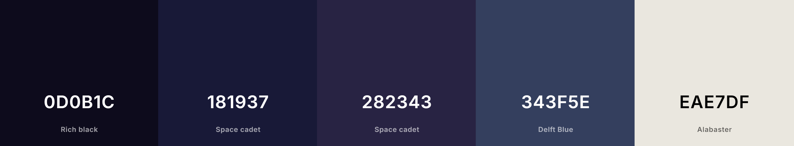

Group Members: Nick Benson, Jack Fiacco, Sam Chapin, Ariana Overko

## About lunatech
Lunatech is a wireless headphone company that sells comfortable and high quality headphones. 

## Ideal Website 
Our website would require a landing page to display our company name and a quick "about", with some best sellers and sales below. It would also need to have a separate catalog with browsable products. The site should reflect the company's identity as a futuristic and high quality manufacturer of headphones.

## Required Data
1) Product ID
2) Product Name
3) Product Image
4) Product Description
5) Product Price
6) Username
7) Password
8) Items in Cart
9) Amount to Charge

## Website Design
DB Table Architecture:
[see tables](db_tables.md)

Page Designs:
[click me!](pagedesigns.md)

### Color Scheme

## Website Pages
1) Landing Page: Identity, Bestsellers
2) Catalog: Wireless Headphones
3) Login Page
4) Account Creation
5) User Cart
6) Profile