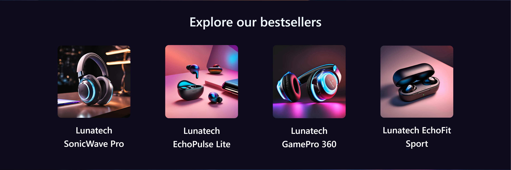

Group Members: Ariana Overko, Nick Benson, Jack Fiacco, Sam Chapin

## About lunatech
Lunatech is a wireless headphone company that sells comfortable and high quality headphones. 

## Ideal Website 
Our website would require a landing page to display our company name and a quick "about", with some best sellers and sales below. It would also need to have a separate catalog with browsable products. The site should reflect the company's identity as a futuristic and high quality manufacturer of headphones.

## Required Data
1) Product ID
2) Product Name
3) Product Image
4) Product Description
5) Product Price
6) Username
7) Password
8) Items in Cart
9) Amount to Charge

## Website Design
DB Table Architecture:
[see tables](db_tables.md)

WireFrames:
[see wireframes](wireframes.md)

### Color Scheme

## Website Pages
1) Landing Page: Identity, Bestsellers
2) Catalog: Wireless Headphones
3) Product Details
4) User Cart
5) Login Page
6) Account Creation
7) Employee Dashboard
8) Employee Product Dashboard
9) Manage Product
10) Add Product
11) Manage Employees Dashboard
12) View Employee Profile

Disclaimer: this site is NOT YET scalable or size responsive

